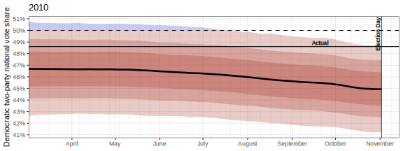
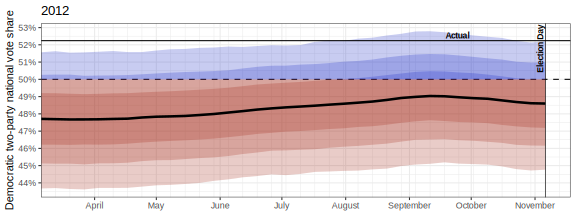
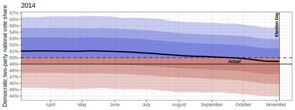
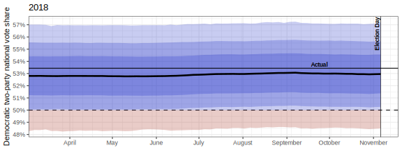
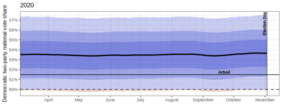

<!-- README.md is generated from README.Rmd. Please edit that file -->

```{r, include = FALSE}
library(tidyverse)
library(here)
knitr::opts_chunk$set(
    echo = FALSE,
    message = FALSE,
    warning = FALSE,
    collapse = TRUE,
    fig.path = "doc/",
    out.width = "100%"
)
set.seed(5118)
```

# Federal Election Predictions 2022

#### Cory McCartan


A dynamic Bayesian model to forecast the 2022 U.S. House elections.

## Directory structure
- Code for all the analyses in [`R/`](R/) and [`stan/`](stan/). README files in
each subdirectory contain more information.
- Tracked, processed data are in [`data/`](data/); untracked and raw data are in
[`data-raw/`](data-raw/).

## Model structure and details

**Jump to: [Fundamentals](#fundamentals-model) • [Firms](#firm-error-model) • 
[National intent](#national-intent-model) • [Outcomes](#outcomes-model)**


### Fundamentals model

The fundamentals model is Bayesian linear regression of national two-way vote share for the
incumbent president's party on logit retirements; house control (1 if incumbent president's
party controls the House), and presidential control (1 for a Dem. president); an
economic indicator; logit presidential approval; and several interactions with
polarization, measured as the correlation between House and presidential results
in the previous election.
The model is fit separately to presidential and midterm years.
The economic indicator is the first principal component of three economic indicators:
GDP change over the past year, log unemployment rate; and urban CPI change over the past year (inflation).
The principal components are calculated only on data from 1948--2006 to allow
the weights to be used in predictive models after 2008.
To build national two-way vote share, we impute vote share for uncontested House
races using a BART model fit on contested House elections from 1976 to 2020.
Coefficients are given an [R2-D2 prior](https://arxiv.org/abs/2111.10718).
The data are available [here](data/fundamentals.csv).

**Parameter estimates:**
```{r fund_model_est, fig.height=3}
m <- readRDS(here("data-raw/produced/fundamentals_model_2022.rds"))
brms::mcmc_plot(m) +
    geom_vline(xintercept=0, lty="dashed") +
    theme_bw() +
    theme(axis.text.y=element_text(face="bold"))
```

**Fundamentals-only prediction for 2022:**
```{r fund_model_pred, fig.height=3}
pred <- readRDS(here("data/fund_pred/fundamentals_pred_2022.rds"))
ggplot(NULL, aes(plogis(pred), fill=pred > 0)) + 
    geom_histogram(bins=32) +
    scale_y_continuous(name=NULL, expand=expansion(mult=c(0, 0.03))) +
    scale_x_continuous(name="Democratic two-party vote share", labels=scales::percent) +
    scale_fill_manual(values=c("#A0442C", "#0064B0"), guide="none") +
    theme_bw()  +
    theme(panel.grid.minor=element_blank(),
          axis.title.x=element_text(face="bold"))
```

### Firm error model

The firm error model goes hand-in-hand with the firm error component of the
national intent model, below.
The idea is to use historical firm performance in polling the generic ballot and
presidential races as a prior for firm performance this cycle.
We can decompose firm error into several components:

- Constant year-to-year bias in all firms in polling these races.
- Year-specific bias shared by all firms, to varying extents. We call the
extent to which a firm is affected by the year-specific shared bias the
"herding," which is a slightly idiosyncratic usage.
- Firm bias.
- Bias from polling methodology (IVR/online/phone/mixed/unknown).
- Bias from LV polls. Due to limited data we only code an indicator for if a
poll is not an LV poll---we don't distinguish between RV/A/V polls.

Given total firm bias from all these sources, firms also vary in how close their
results cluster around this bias.
If a firm consistently reports numbers 5pp too favorable for Democrats, we can adjust for that.
Less consistency means less adjustment is possible.
Polling variance is affected by several factors:

- Sample size
- Time to the election
- LV vs. other polls
- Firm variance

We operationalize this framework with the following model, which is fit to
around 5,100 historical polling results.

$$
\begin{align*}
y_i &\sim \mathcal{N}(\mu_i, \sigma_i^2) \\
\mu_i &= \beta_\mu + \alpha_{f[i]}^{(f)} + \alpha_{c[i]}^{(c)} +
        + \alpha_{u[i]}^{(u)} + \alpha_{c[i]}^{(v)}v[i] \\
\sigma_i &= \exp(\beta_\sigma + x_i^\top\gamma_\sigma + \phi_{f[i]}^{(f)}) \\
\alpha^{(f)} &\stackrel{iid}{\sim} \mathcal{N}(0, \tau^2_f), \quad
\alpha_{c}^{(c)} \stackrel{iid}{\sim} \mathcal{N}(\alpha_{c-1}^{(c)}, \tau^2_c), \quad
\alpha^{(u)} \stackrel{iid}{\sim} \mathcal{N}(0, \tau^2_u), \quad
\alpha^{(v)} \stackrel{iid}{\sim} \mathcal{N}(0, \tau^2_v)\\
\phi^{(f)} &\stackrel{iid}{\sim} \mathcal{N}(0, \tau^2_\phi)
\end{align*}
$$

where $i$ indexes the polls, $f[i]$ is the firm, $c[i]$ is the year/cycle, $u[i]$ is the methodology, $v[i]$ is the survey population indicator (1 if not LV), $m_{f[i]}$ is the herding variable for each firm, and $x_i$ is a vector of poll variance predictors: $\log(N_i)$, $\sqrt{\text{time to elec.}}$, and the not-LV indicator.
Further details, including the weakly informative priors on all the parameters, may be found in the [Stan model code](stan/firms.stan) and [fitting code](R/build/firms.R).

We can simulate from the model to get *predictive* values of firm bias and variance in hypothetical election-day likely voter polls for the 2022 election.
These predictive values are the best way to evaluate each firm's overall quality for this election.
A firm is better---that is, its polls contain more information about the race---if it has lower variance (std. dev.), a lower herding value, and bias closer to 0 (though this will be adjusted for).

**Summary of firm performance:**
```{r firm_perf, fig.height=6, fig.width=8}
library(geomtextpath)
library(wacolors)
library(scales)

d_firms <- read_csv(here("data/firms_pred_eval.csv"), show_col_types=FALSE)
d_contour = crossing(bias=with(d_firms, seq(min(0, min(bias)*1.1), max(bias)*1.1, 0.002)),
                     stdev=with(d_firms, seq(min(stdev)*0.95, max(stdev)*1.05, 0.002))) |>
    mutate(rmse = sqrt(bias^2 + stdev^2))


regex_tidy = str_c(" (a|for|The|Surveys?|&|Co\\.?|Company|Corp\\.?|Inc\\.?|Panel|Group|",
                   "University|College|News|Research|Associates|Partners|Marketing|Strategies) ")
d_firms |>
    mutate(lab = str_c(" ", str_remove(firm, "\\(.+\\)"), " "),
           lab = str_replace_all(lab, "/", " / "),
           lab = str_replace(lab, regex_tidy, " "),
           lab = str_replace(lab, regex_tidy, " "),
           lab = str_replace(lab, regex_tidy, " "),
           lab = suppressWarnings(abbreviate(lab, 8))) |>
    # arrange(herding) |>
ggplot(aes(bias, stdev, label=lab, size=n)) +
    geom_vline(xintercept=0, lty="dashed", size=0.3) +
    geom_textcontour(aes(bias, stdev, z=rmse, label=str_c("RMSE ", after_stat(level))),
                     data=d_contour, inherit.aes=F,
                     color="#777777", size=2.5, linewidth=0.2, hjust=0.05) +
    geom_text(fontface="bold") +
    scale_y_log10("Std. deviation (lower is better)",
                  labels=label_number(scale=100, suffix="pp")) +
    scale_x_continuous("Bias (positive = favors Democrats)",
                       labels=label_number(scale=100, suffix="pp")) +
    # scale_color_wa_c("puget", name="Herding", midpoint=1, reverse=T) +
    scale_size(range=c(1.5, 4), guide="none") +
    coord_cartesian(expand=FALSE) +
    theme_bw()
```

### National intent model

The intent model estimates latent national vote intent, which is assumed to
evolve as a random walk, with and observation model that is closely related to
the firm error model, above.

$$
\begin{align*}
y_i &\sim \mathcal{N}(\mu_i, \sigma_i^2) \\
\mu_i &= x_{t[i]} + \beta_\mu + \alpha_{f[i]}^{(f)} + \alpha^{(c)}
        + \alpha_{u[i]}^{(u)} + \alpha^{(v)}v[i] \\
\sigma_i &= \exp(\beta_\sigma + x_i^\top\gamma_\sigma + \phi_{f[i]}^{(f)}) \\
x_t &= x_{t-1} + \delta_t,\quad
\delta_t \stackrel{iid}{\sim} \mathrm{t_5}(0, \sigma^2_\delta) \\
\alpha^{(f)} &\stackrel{iid}{\sim} \mathcal{N}(0, \tau^2_f), \quad
\alpha^{(c)} \sim \mathcal{N}(\alpha_{c_{old}}^{(c)}, \tau^2_c), \quad
\alpha^{(u)} \stackrel{iid}{\sim} \mathcal{N}(0, \tau^2_u), \quad
\alpha^{(v)} \sim \mathcal{N}(0, \tau^2_v)\\
\phi^{(f)} &\stackrel{iid}{\sim} \mathcal{N}(0, \tau^2_\phi),
\end{align*}
$$

where $i$ indexes the polls and $t$ indexes the days before the election, $y$ is the poll outcome, $x$ is the latent intent, $f[i]$ is the firm, $u[i]$ is the methodology, $v[i]$ is the survey population indicator (1 if not LV), and $x_i$ is a vector of poll variance predictors: $\log(N_i)$, $\sqrt{\text{time to elec.}}$, and the not-LV indicator.
Priors for most variables are taken from the posterior of the firm error model (above), with some adjustments as noted below.
The prior on $x$ for election day is taken from the posterior predictive distribution of the fundamentals model, shown above in the histogram.
A relatively strong prior is needed on $\sigma^2_\delta$ to regularize the effect of firms who release panel survey results daily.
We also cap the number of polls from any one firm at 100 to further avoid biasing effects from imbalance (which is observed in historical back-testing).
Firms with more than 100 polls have a subset of 100 selected at random for inference.
Since the random effects $\alpha^{(c)}$ and $\alpha^{(v)}$ are unknown for this particular cycle, they are sampled from their predictive distributions.
Further details, including the weakly informative priors on all the parameters, may be found in the [Stan model code](stan/intent.stan), [fitting code](R/model/intent.R), and [diagnostic code](R/build/build_intent.R).

Estimates for the 2010--2020 cycles, based only on previous years, are shown below.













### Outcomes model
