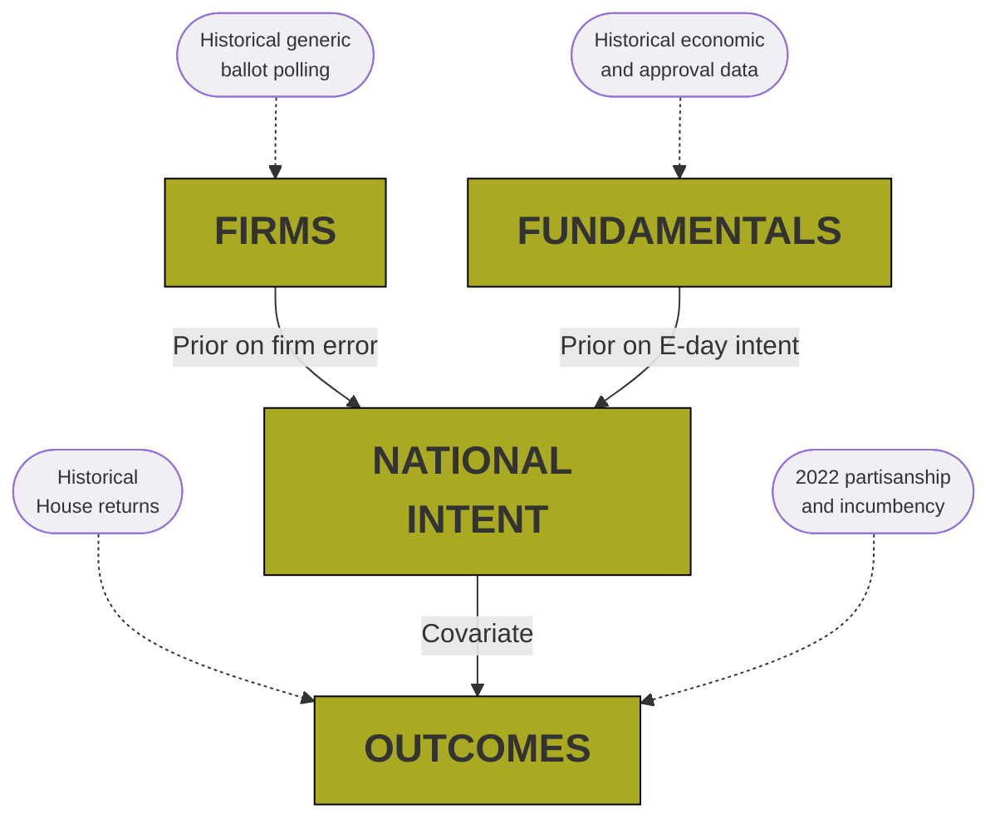

# Federal Election Predictions 2022
#### Cory McCartan

## About
A dynamic Bayesian model to forecast the 2022 U.S. House elections.

## Model structure

## File structure
- Code for all the analyses in [`R/`](R/)
<!-- - Data, along with details on data sources, in [`data/`](data/) -->
