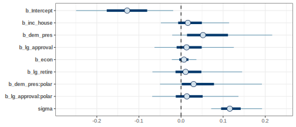
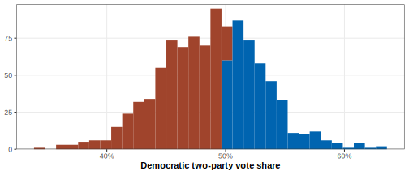

<!-- README.md is generated from README.Rmd. Please edit that file -->

# Federal Election Predictions 2022

#### Cory McCartan

A dynamic Bayesian model to forecast the 2022 U.S. House elections.

## Directory structure

- Code for all the analyses in [`R/`](R/) and [`stan/`](stan/). README
  files in each subdirectory contain more information.
- Tracked, processed data are in [`data/`](data/); untracked and raw
  data are in [`data-raw/`](data-raw/).

## Model details

#### Model structure

### Fundamentals Model

Bayesian linear regression of national two-way contested vote share for
the incumbent president’s party on logit retirements; midterm, house,
and presidential control indicators; GDP change over the past year, log
unemployment rate; and logit presidential approval. Coefficients are
given an [R2-D2 prior](https://arxiv.org/abs/2111.10718). Coefficient
estimates: 

Fundamentals-only prediction for 2022:

