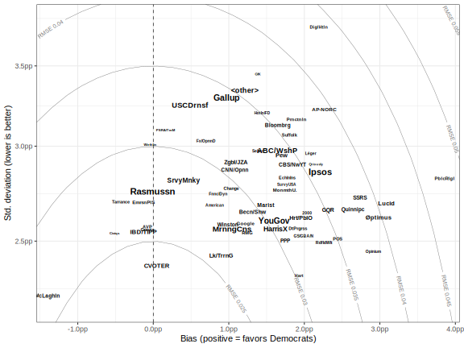

<!-- README.md is generated from README.Rmd. Please edit that file -->

# Federal Election Predictions 2022

#### Cory McCartan

A dynamic Bayesian model to forecast the 2022 U.S. House elections.

## Directory structure

- Code for all the analyses in [`R/`](R/) and [`stan/`](stan/). README
  files in each subdirectory contain more information.
- Tracked, processed data are in [`data/`](data/); untracked and raw
  data are in [`data-raw/`](data-raw/).

## Model structure and details

**Jump to: [Fundamentals](#fundamentals-model) •
[Firms](#firm-error-model) • [National intent](#national-intent-model) •
[Outcomes](#outcomes-model)**

### Fundamentals model

Bayesian linear regression of national two-way contested vote share for
the incumbent president’s party on logit retirements; midterm, house,
and presidential control indicators; GDP change over the past year, log
unemployment rate; and logit presidential approval. Coefficients are
given an [R2-D2 prior](https://arxiv.org/abs/2111.10718). [Data
here](data/fundamentals.csv).

**Parameter estimates:**

**Fundamentals-only prediction for 2022:**

### Firm error model

The firm error model goes hand-in-hand with the firm error component of
the national intent model, below. The idea is to use historical firm
performance in polling the generic ballot and presidential races as a
prior for firm performance this cycle. We can decompose firm error into
several components:

- Constant year-to-year bias in all firms in polling these races.
- Year-specific bias shared by all firms, to varying extents. We call
  the extent to which a firm is affected by the year-specific shared
  bias the “herding,” which is a slightly idiosyncratic usage.
- Firm bias.
- Bias from polling methodology (IVR/online/phone/mixed/unknown).
- Bias from LV polls. Due to limited data we only code an indicator for
  if a poll is an LV poll, and don’t distinguish between RV/A/V polls.

Given total firm bias from all these sources, firms also vary in how
close their results cluster around this bias. If a firm consistently
reports numbers 5pp too favorable for Democrats, we can adjust for that.
Less consistency means less adjustment is possible. Polling variance is
affected by several factors:

- Sample size
- Time to the election
- LV vs. other polls
- Firm variance

We operationalize this framework with the following model, which is fit
to around 5,100 historical polling results.

![\begin{align\*}
y_i &\sim \mathcal{N}(\mu_i, \sigma_i^2) \\\\
\mu_i &= \beta\_\mu + \alpha^{(f)}\_{f\[i\]} + m\_{f\[i\]}\alpha^{(t)}\_{t\[i\]}
        + \alpha^{(u)}\_{u\[i\]} + \alpha^{(v)}\_{v\[i\]} \\\\
\sigma_i &= \exp(\beta\_\sigma + x_i^\top\gamma\_\sigma + \phi^{(f)}\_{f\[i\]}) \\\\
\alpha^{(f)} &\stackrel{iid}{\sim} \mathcal{N}(0, \tau^2_f), \quad
\alpha^{(t)} \stackrel{iid}{\sim} \mathcal{N}(0, \tau^2_t), \quad
\alpha^{(u)} \stackrel{iid}{\sim} \mathcal{N}(0, \tau^2_u), \quad
\alpha^{(v)} \stackrel{iid}{\sim} \mathcal{N}(0, \tau^2_v)\\\\
\log(m) &\stackrel{iid}{\sim} \mathcal{N}(0, \tau^2_m), \quad
\phi^{(f)} \stackrel{iid}{\sim} \mathcal{N}(0, \tau^2\_\phi)
\end{align\*}](https://latex.codecogs.com/png.image?%5Cdpi%7B110%7D&space;%5Cbg_white&space;%5Cbegin%7Balign%2A%7D%0Ay_i%20%26%5Csim%20%5Cmathcal%7BN%7D%28%5Cmu_i%2C%20%5Csigma_i%5E2%29%20%5C%5C%0A%5Cmu_i%20%26%3D%20%5Cbeta_%5Cmu%20%2B%20%5Calpha%5E%7B%28f%29%7D_%7Bf%5Bi%5D%7D%20%2B%20m_%7Bf%5Bi%5D%7D%5Calpha%5E%7B%28t%29%7D_%7Bt%5Bi%5D%7D%0A%20%20%20%20%20%20%20%20%2B%20%5Calpha%5E%7B%28u%29%7D_%7Bu%5Bi%5D%7D%20%2B%20%5Calpha%5E%7B%28v%29%7D_%7Bv%5Bi%5D%7D%20%5C%5C%0A%5Csigma_i%20%26%3D%20%5Cexp%28%5Cbeta_%5Csigma%20%2B%20x_i%5E%5Ctop%5Cgamma_%5Csigma%20%2B%20%5Cphi%5E%7B%28f%29%7D_%7Bf%5Bi%5D%7D%29%20%5C%5C%0A%5Calpha%5E%7B%28f%29%7D%20%26%5Cstackrel%7Biid%7D%7B%5Csim%7D%20%5Cmathcal%7BN%7D%280%2C%20%5Ctau%5E2_f%29%2C%20%5Cquad%0A%5Calpha%5E%7B%28t%29%7D%20%5Cstackrel%7Biid%7D%7B%5Csim%7D%20%5Cmathcal%7BN%7D%280%2C%20%5Ctau%5E2_t%29%2C%20%5Cquad%0A%5Calpha%5E%7B%28u%29%7D%20%5Cstackrel%7Biid%7D%7B%5Csim%7D%20%5Cmathcal%7BN%7D%280%2C%20%5Ctau%5E2_u%29%2C%20%5Cquad%0A%5Calpha%5E%7B%28v%29%7D%20%5Cstackrel%7Biid%7D%7B%5Csim%7D%20%5Cmathcal%7BN%7D%280%2C%20%5Ctau%5E2_v%29%5C%5C%0A%5Clog%28m%29%20%26%5Cstackrel%7Biid%7D%7B%5Csim%7D%20%5Cmathcal%7BN%7D%280%2C%20%5Ctau%5E2_m%29%2C%20%5Cquad%0A%5Cphi%5E%7B%28f%29%7D%20%5Cstackrel%7Biid%7D%7B%5Csim%7D%20%5Cmathcal%7BN%7D%280%2C%20%5Ctau%5E2_%5Cphi%29%0A%5Cend%7Balign%2A%7D "\begin{align*}
y_i &\sim \mathcal{N}(\mu_i, \sigma_i^2) \\
\mu_i &= \beta_\mu + \alpha^{(f)}_{f[i]} + m_{f[i]}\alpha^{(t)}_{t[i]}
        + \alpha^{(u)}_{u[i]} + \alpha^{(v)}_{v[i]} \\
\sigma_i &= \exp(\beta_\sigma + x_i^\top\gamma_\sigma + \phi^{(f)}_{f[i]}) \\
\alpha^{(f)} &\stackrel{iid}{\sim} \mathcal{N}(0, \tau^2_f), \quad
\alpha^{(t)} \stackrel{iid}{\sim} \mathcal{N}(0, \tau^2_t), \quad
\alpha^{(u)} \stackrel{iid}{\sim} \mathcal{N}(0, \tau^2_u), \quad
\alpha^{(v)} \stackrel{iid}{\sim} \mathcal{N}(0, \tau^2_v)\\
\log(m) &\stackrel{iid}{\sim} \mathcal{N}(0, \tau^2_m), \quad
\phi^{(f)} \stackrel{iid}{\sim} \mathcal{N}(0, \tau^2_\phi)
\end{align*}")

where

indexes the polls,
![f\[i\]](https://latex.codecogs.com/png.image?%5Cdpi%7B110%7D&space;%5Cbg_white&space;f%5Bi%5D "f[i]")
is the firm,
![t\[i\]](https://latex.codecogs.com/png.image?%5Cdpi%7B110%7D&space;%5Cbg_white&space;t%5Bi%5D "t[i]")
is the year,
![u\[i\]](https://latex.codecogs.com/png.image?%5Cdpi%7B110%7D&space;%5Cbg_white&space;u%5Bi%5D "u[i]")
is the methodology,
![v\[i\]](https://latex.codecogs.com/png.image?%5Cdpi%7B110%7D&space;%5Cbg_white&space;v%5Bi%5D "v[i]")
is the survey population,
![m\_{f\[i\]}](https://latex.codecogs.com/png.image?%5Cdpi%7B110%7D&space;%5Cbg_white&space;m_%7Bf%5Bi%5D%7D "m_{f[i]}")
is the herding variable for each firm, and

is a vector of poll variance predictors:
"),
,
and the LV/not indicator. Further details, including the weakly
informative priors on all the parameters, may be found in the [Stan
model code](stan/firms.stan) and [fitting code](R/build/firms.R).

We can simulate from the model to get *predictive* values of firm bias
and variance in hypothetical election-day likely voter polls for a
future election. These predictive values are the best way to evaluate
each firm’s overall quality. A firm is better—that is, its polls contain
more information about the race—if it has lower variance (std. dev.), a
lower herding value, and bias closer to 0 (though this can be adjusted
for).

**Summary of firm performance:**

### National intent model

### Outcomes model
